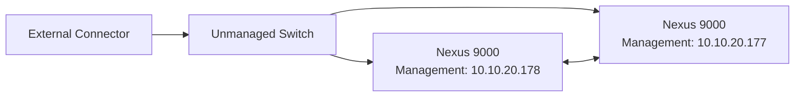

# Goal
Connect to a Cisco Devnet lab and configure routers using CI/CD pipelines with Ansible, also use Terraform to do this

## Documentation
The lab was taken from:
> https://developer.cisco.com/docs/ansible-fest-lab-guide/introduction/#welcome-to-red-hat-summit-ansible-fest-2024

Under devnet

start the lab **CI/CD pipeline for infrastructure automation**

## Connection
I will be using a Windows machine, this means that once the devnet launches the lab I will need to configure VPN, I will be using openConnect VPN.

### OpenConnect VPN
Once you get the email from devnet with the credentials you need to follow these steps:

1. Open OpenConnect GUI.
2. Edit your Cisco lab VPN profile.
    * Open Advanced settings.
    * Find Local interface or Interface name.
    * Replace the generated value with a short name:
    > mvpn
    * Save the profile.
    * Completely exit OpenConnect.
    * Start OpenConnect using Run as administrator and reconnect.

Avoid using the full Cisco hostname as the interface name.

### Topology

There are two nodes that are running for this lab, the first one is node running CML the second one is a CentOS7 node running gitLab. under CML the topology is

### Ansible 
Ansible will act as the configuration management tool for the CI/CD pipeline