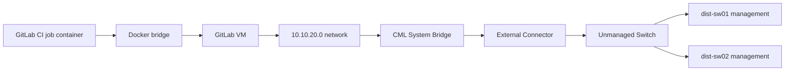
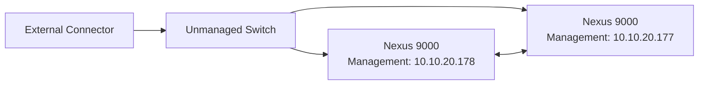

# Goal
This lab comes from the lab 
> https://developer.cisco.com/docs/ansible-fest-lab-guide/introduction/#welcome-to-red-hat-summit-ansible-fest-2024
The goal is to configure some NXOS switches on CML via CICD using Ansible.

To do this I used the lab 
> https://devnetsandbox.cisco.com/DevNet/catalog/ansible-days_ansible-days

The reason to choose this lab was because I can run Cisco equipment on CML and Gitlab is already setup for me.

## Topology


## Connection
I will be using a Windows machine, this means that once the devnet launches the lab I will need to configure VPN, I will be using openConnect VPN.

### OpenConnect VPN
Once you get the email from devnet with the credentials you need to follow these steps:

1. Open OpenConnect GUI.
2. Edit your Cisco lab VPN profile.
    * Open Advanced settings.
    * Find Local interface or Interface name.
    * Replace the generated value with a short name:
    > mvpn
    * Save the profile.
    * Completely exit OpenConnect.
    * Start OpenConnect using Run as administrator and reconnect.

Avoid using the full Cisco hostname as the interface name.

### Topology

There are two nodes that are running for this lab, the first one is node running CML the second one is a CentOS7 node running gitLab. under CML the topology is



### Ansible 
Ansible will act as the configuration management tool for the CI/CD pipeline.


## GOAL of the lab
After setup of the lab the goal is to create a new interface on each of the two virtual switches, Loopback100, configure it for OSPF and make sure is propagated throughout the network.

### Steps

1. Configure the files in **host_vars** and add the extra interface on both virtual switches.
2. Modify the pyATS files to check if the configuration is applied correctly

this is the current config of the loopbacks of the switches:

SW1
```
dist-sw01# sh run interface | sec loopback
interface loopback0
  description loopback0 Configured by Ansible
  ip address 192.168.0.1/32
  ip router ospf 1 area 0.0.0.0
```

SW2
```
dist-sw02# sh run interface | sec loopback
interface loopback0
  description loopback0 Configured by Ansible
  ip address 192.168.0.2/32
  ip router ospf 1 area 0.0.0.0
  ```


  result:
  ```
  dist-sw02# sh run interface | sec loopback
interface loopback0
  description Loopback0 Configured by Ansible
  ip address 192.168.0.2/32
  ip router ospf 1 area 0.0.0.0
interface loopback100
  description Loopback100 Configured by Ansible
  ip address 192.168.100.2/32
  ip router ospf 1 area 0.0.0.0
  ```
